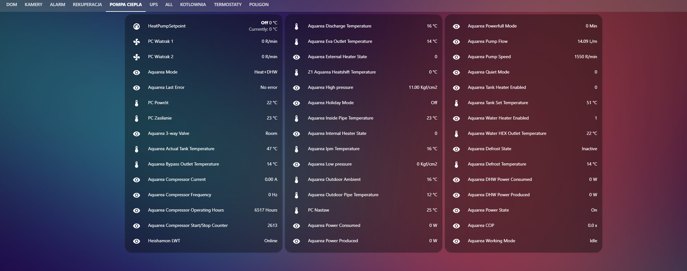

# -!!!!!!! Latest checked release is 1.0.135 !!!!! Others are tests ,and some of them can brick CZ-TAW1.!!!!!!!-

This project is to modify Panasonic CZ-TAW1 Firmware to send data from heat pump to MQTT instead of Aquarea Cloud (there is some POC work proving there is a posiblity to send data concurently to Aquarea Cloud and MQTT host using only modified CZ-TAW1 ,but it's not yet implemented in this project )

### This Project Contains:

- Main software (called GoHeishaMon) responsible for parsing data from heat pump - it's golang implementation of project https://github.com/Egyras/HeishaMon 
All MQTT topics are compatible with HeishaMon project: https://github.com/Egyras/HeishaMon/blob/master/MQTT-Topics.md
and there are two aditional topics to run command's in system runing the software but it need's another manual.

GoHeishaMon can be used without the CZ-TAW1 module on every platform supported by golang (RaspberyPi, Windows, Linux, OpenWrt routers for example) after connecting it to Heatpump over rs232-ttl interface.
If you need help with this project you can try Slack of Heishamon project there is some people who manage this one :)

- OpenWRT Image with preinstalled GoHeishaMon (and removed A2Wmain due to copyright issues) 

CZ-TAW1 flash memory is divided for two parts called "sides". During Smart Cloud update A2Wmain software programing other side then actually it boots ,and change the side just before reboot. In this way, normally in CZ-TAW1 there are two versions of firmware: actual and previous.
Updating firmware with GoHeishaMon we use one side , and we can very easly change the side to Smsrt Cloud (A2Wmain software) by pressing all three buttons on CZ-TAW1 when GoHeishaMon works ( middle LED will change the color to RED and shortly after this it reboots to orginal SmartCloud.
Unfortunatly from Smart Cloud software changing the side without having acces to ssh console is possible only when updating other side was take place succesfully.

Summary: 

It is possible to go back to orginal software (A2Wmain with SmartCluod) very quick , without preparing pendrive ,becouse this solution don't remove firmware with A2Wmain (is still on other  "Side" in the flash).

Even the GoHeishaMon is on other side you can't just change the site in orginal software to GoHeishaMon without acces to console. You have to install GoHeishaMon again. 

### Installation

For installing GoHeishaMon on CZ-TAW1 you need a clean USB drive FAT32 formatted  (there is a problem with some pendrive vendors if it didin't work try another one) https://github.com/lsochanowski/GoHeishaMon/releases/tag/1.0.135
copy to usb drive files :
- openwrt-ar71xx-generic-cus531-16M-rootfs-squashfs.bin
- openwrt-ar71xx-generic-cus531-16M-kernel.bin
- GoHeishaMonConfig.new ( It is config.example file edited according to your needs and changed it's name)

After inserting drive with this files in runing CZ-TAW1 you need to push 3 buttons at once for more tnah 10 seconds until middle LED start changing the colors: green-blue-red. You may also notice the LED blinking on your drive ( if drive have it).

Process of update starts ,and it will take app 3 min. In the meantime CZ-TAW1 reboots , and after a while you will notice middle LED lights white color , so the GoHeishaMon just starts up. Wait with removing drive from module minimum 20s from this moment ,since GoHeishaMOn needs to copy config file.

## SSH and web (over LuCI) access

For advanced ussers there is possibility to have SSH and web acces (LuCI) on CZ-TAW1 with user: root and password: GoHeishaMonpass ( you should change it!)
- In config file you should have option "EnableCommand=true"
- GoHeishaMon should be connected to MQTT server
- Public in MQTT topic "panasonic_heat_pump/OSCommand" one by one : "umount /overlay" , "jffs2reset -y" and finally "reboot". This will perform a so called firstboot , so all configuration ( also including WiFi connection) will be set to default , so please connect GoHeishaMon via Ethernet cable after that. WiFi config after that you can do via ssh or LuCI ,identical to standard OpenWRT routers.

---- AUTO BUILD  for MIPS don't work....------
Todo:

- rest of the commands
- queue command from a2wmain 
- flag to point to config file
- manuals 
- tests 

..... more....
